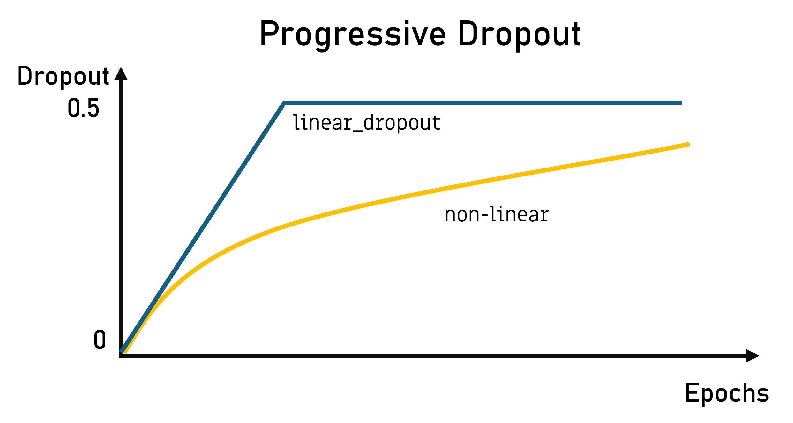
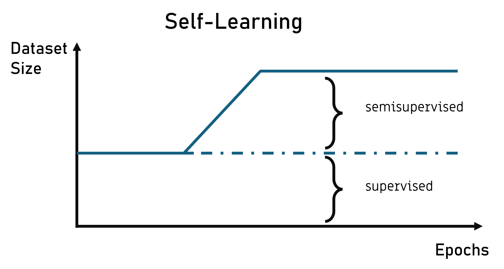
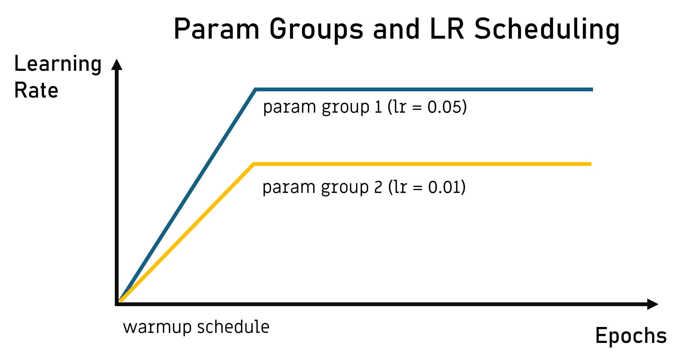

### ML Training Techniques
This project summarizes different building blocks of ML training techniques to stabilize and speed up training of deep neural networks. The focus is on the training process itself, not on the model architecture. The goal is to provide a comprehensive overview of the most important techniques and to give a guideline for the practical use of these techniques.
Not considered are model changes, like changing the model architecture or the type of loss function.
The techniques are shown using the MNIST dataset and a simple CNN model with chapter based differences. The code is written in PyTorch.
Every Technique is showcased using its own training script.

Planned is:
- [Base Case](#base-case)
- [Weighted Data Sampling](#weighted-data-sampling)
- [Progressive Curriculum Learning: Progressive Dropout](#progressive-curriculum-learning-progressive-dropout)
- [Progressive Curriculum Learning: Semi Supervised Learning](#progressive-curriculum-learning-semi-supervised-learning)
- [Learning Rate Scheduling](#learning-rate-scheduling-)
- [Parameter Groups - Layerwise Learning Rate & Weight Decay](#parameter-groups)
- [Weight Initialization in Pytorch](#weight-initialization-in-pytorch)
- [Distillation Intermediate Layer Outputs as Additional Loss](#distillation-intermediate-layer-outputs-as-additional-loss)
- Supervised Pretraining (Transfer Learning)
- Self-Supervised Pretraining Masked Image Modeling
- Self-Supervised Contrastive Learning like MoCo

- Semi-Supervised Learning
- Data Augmentation


#### Base Case
The base case is a simple `ConvNet` model. The model consists of two convolutional layers followed a linear layer to downproject onto the number of classes. The model is trained for 10 epochs with a batch size of 32 and a learning rate of 0.01. The loss function is the cross-entropy loss. The optimizer is the AdamW optimizer. The model is trained on 10 percent of the training set to be able to easily extend the dataset later. The accuracy is tracked for training and validation.
The according training script is `tr_baseline.py`[🔗](training/tr_baseline.py).

#### Weighted Data Sampling
This technique is used to balance the dataset. The MNIST dataset is already balanced, but the technique is shown for demonstration purposes. The training script is `tr_weighted_sampling.py`[🔗](training/tr_weighted_sampling.py). The script uses the `WeightedRandomSampler` from Pytorch to sample the data. The weights are calculated based on the class distribution of the dataset.  The weights are defined by class and input into the DataModule as 
```python
class_weights=[0.1,0,1,1,1,1,1,1,1,]
```
The above code would mean that the class 0 is sampled with a probability of 0.1, class 1 is not sampled, and all other classes are sampled with a probability of 1. The weights are normalized to sum up to 1. 
#### Progressive Curriculum Learning (CL): Progressive Dropout
As a proxy for changing simple model, regularization or other properties changing the dropout percentage is shown. 
The idea is to start easy with low dropout rates and increase the dropout rate over time. The training script is `tr_progressive_dropout.py`[🔗](training/tr_progressive_dropout.py). A broader study was conducted in the paper [Curriculum Dropout](https://arxiv.org/abs/1703.06229). 
In this implementation the dropout change can be implemented in the training script using a callback function to change the dropout rate of a storage variable `dropout_mem` of the model. 
```python
def linear_dropout(
    epoch: int,
    dropout_mem: dict[int, list[int]],
    start_dropout=0.0,
    end_dropout=0.5,
    end_epoch=2,
):

    for dropout_layer_key in dropout_mem:
        dropout_mem[dropout_layer_key][0] = min(
            start_dropout + epoch / end_epoch * (end_dropout - start_dropout),
            end_dropout,
        )
```


#### Semi Supervised Self-Learning (Curriculum Learning)
 Self Learning is a form of [Semi Supervised Learning](https://arxiv.org/pdf/2101.10382). In Self Learning the model is initialized by training on the labeled data first. Afterwards unlabeled examples are added to the dataset where the label is the prediction of the model. The implementation here follows the approach of the paper [Curriculum Labeling: Revisiting Pseudo-Labeling for Semi-Supervised Learning](https://cdn.aaai.org/ojs/16852/16852-13-20346-1-2-20210518.pdf). The main idea is to use a curriculum to add increasingly more and harder examples from the unsupervised subset into the training set. The unsupervised examples are chosen by a increasing confidence quantile of the predictions of the model. In practice the quantile is linearly increased from 0 to 1 from a start epoch to the end epoch. The training script is `tr_self_learning_cl.py`[🔗](training/tr_self_learning_cl.py). The Curriculum is implemented as custom Callback in pytorch lightning (see [here](training_callbacks/SelfLearningQuantileWeighingCallback.py)). The Schedule is than used as 
```python
schedule = SelfLearningQuantileWeighingCallback(
    start_epoch=1, end_epoch=5, verbose=True
)
# This schedule will mix in the unsupervised data from the 2nd to the 5th epoch
# 1. epoch : 0.0 unsupervised data
# 2. epoch : 0.25 unsupervised data
# 3. epoch : 0.5 unsupervised data
# 4. epoch : 0.75 unsupervised data
# 5. epoch : 1.0 unsupervised data
# n. epoch : 1.0 unsupervised data
```


#### Learning Rate Scheduling
**Varying Learning Rate over the Training Epochs** In many cases it might be beneficial to use varying learning rate over the training process. This can also be interpreted as curriculum learning. For example to achieve robust training of transformers oftentimes warmup followed by cosine learning rate is used.
#### Parameter Groups
**Varying Learning Rate and Regularization withing the Layers** In many cases it might be beneficial to use varying learning rate and regularization over the layers of the model. For example to achieve robust training of transformers sometimes layerwise learning rate is used. Typically embeddings are not weight regularized. The partioning into parameter groups is done via the [create_optimizer_groups](technique_abstractions/create_optimizer_groups.py) function. It takes in a list of parameter names to exclude from weight decay as well as a dict of parameter names with the respective learning rate. 
```python
    
    param_groups = create_optimizer_groups(
        model,
        base_learning_rate=0.01,
        dont_decay_parameters=["project_into_classification", "layers.0"], # will not weight project_into_classification.weight and project_into_classification.bias
        learning_rate_factors={
            2: ["project_into_classification", "layers.2.skip.weight"],
        },
        verbose=True,
    )
    # Output Param Groups:
    # Learning Rate: 0.01
    # --------------------
    # Parameter group pg2: 1 parameter tensors
    # Weight Decay: Inherit from Global
    # Learning Rate: 0.02
    # --------------------
    # Parameter group pg3: 2 parameter tensors
    # Weight Decay: 0
    # Learning Rate: 0.02
    # --------------------
    # Parameter group pg4: 8 parameter tensors
    # Weight Decay: 0
    # Learning Rate: 0.01

    # Use the param_groups to configure the optimizer 
    optimizer = torch.optim.AdamW(
            param_groups, lr=0.01, weight_decay=0.01
        )
```


#### Weight Initialization in Pytorch
TODO
#### Distillation Intermediate Layer Outputs as Additional Loss
TODO 
https://arxiv.org/pdf/1503.02531